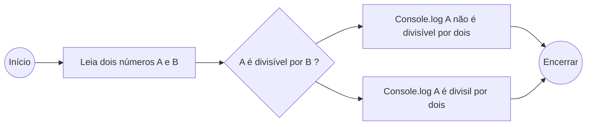

# Programação Estruturada

Aqui é a Raquel e resolvi registrar tudo que eu sei sobre **Programação Estruturada** aqui pra vocês. Sei que pode e é difícil entender a documentação e videos em primeira analise, então espero que esse arquivo ajude.
---

**Programação Estruturada** (PE) é um padrão ou paradigma de programação da engenharia de softwares, com ênfase em sequência, decisão e iteração.

Na programação estruturada, um programa é composto por três tipos básicos de estruturas:
- Sequências: São os comandos a serem executados. 
- Condições: sequências que só devem ser executadas se uma condição for OK. 
>Exemplo:
>(IF-ELSE, switch e outros comandos parecidos.)
- Repetições: sequências que devem ser executadas repetidamente até uma condição for OK.
>Exemplo: 
>(FOR, WHILE, DO-WHILE e outros comandos parecidos.)

Essas estruturas são usadas para executar um codigo, alterando os dados até que a saída OK seja gerada. 

Na programação estruturada, um programa é tipicamente escrito em uma única rotina (ou função) podendo, é claro, ser quebrado em subrotinas. Mas o fluxo do programa continua o mesmo, como se pudéssemos copiar e colar o código das subrotinas diretamente nas rotinas que as chamam, de tal forma que, no final, só haja uma grande rotina que execute todo o programa.

Além disso, o acesso às variáveis não possuem muitas restrições na programação estruturada. Em linguagens fortemente baseadas nesse paradigma, restringir o acesso à uma variável se limita a dizer se ela é visível ou não dentro de uma função

